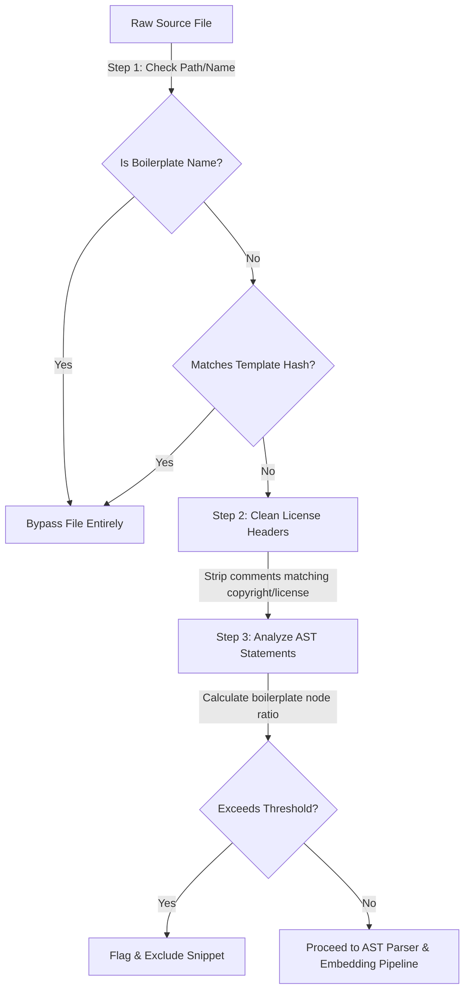

# Technical Blueprint: Framework Boilerplate & License Filtering

This blueprint details the architecture and mechanisms implemented on Day 15 of the sprint to detect and filter out framework boilerplate, standard templates, and open-source license headers before vector embeddings or architectural analysis occur.

---

## 1. Supported Framework Profiles

The filter identifies standard boilerplate structures belonging to popular modern web frameworks:

*   **FastAPI / Flask / Django (Python)**: Detects standard route registrations (`@app.get`), CORS middleware configurations, settings configurations (`settings.py`), and default entrypoint scripts (`manage.py`, `wsgi.py`).
*   **React / Express (JavaScript/TypeScript)**: Identifies package locks (`package-lock.json`, `yarn.lock`), build scripts (`webpack.config.js`), and default template files (Create React App default configurations).
*   **Spring Boot / Java**: Filters maven/gradle configs and standard file layout paths.

---

## 2. Pattern Matching Strategies

We apply a three-tiered filtering pipeline to isolate framework structure noise from custom business logic:

### A. Exact Path/Name Matching
Standard configurations (`pyproject.toml`, `setup.py`, `tailwind.config.js`) do not represent plagiarized logic and are bypassed instantly.

### B. Template Signature Hashing (MD5)
To intercept unaltered template code (such as default Django `manage.py` files), the filter computes the file's MD5 checksum and compares it against `KNOWN_BOILERPLATE_HASHES`, bypassing matching items.

### C. License Header Stripping
Standard copyright license notices (MIT, Apache, GPL, BSD) are stripped from comment headers using regex checks (`LICENSE_REGEX`), preventing common licenses from inflating similarity metrics.

### D. AST Line-Ratio Thresholding
For hybrid files containing custom code mixed with boilerplate (e.g. entrypoint files), the filter walks the Python AST:
*   Counts imports and empty boilerplate assignment statements (such as `app = FastAPI()`).
*   Computes: $\text{Boilerplate Ratio} = \frac{\text{Boilerplate Nodes}}{\text{Total AST Nodes}}$.
*   If the ratio exceeds a threshold (e.g., `0.70`), the snippet is excluded from database indexing.

---

## 3. Performance Overhead Metrics

To keep I/O scans fast and prevent blocking pipeline processing:
*   **Filename & Hash checks**: Runs in $O(1)$ time, bypassing files instantly before loading their contents into memory.
*   **License Cleaners**: Performs in $O(L)$ linear line complexity.
*   **AST Parsers**: Evaluates in sub-millisecond ranges (adds $<1.5$ ms per file), ensuring compile pipelines remain zero-halt.

---

## 4. Implementation Location
*   Exclusion Engine: [boilerplate_filter.py](file:///c:/Users/MANAV/Desktop/Adani%20Uni/Projects/Aiagents/agents/originality/boilerplate_filter.py)
