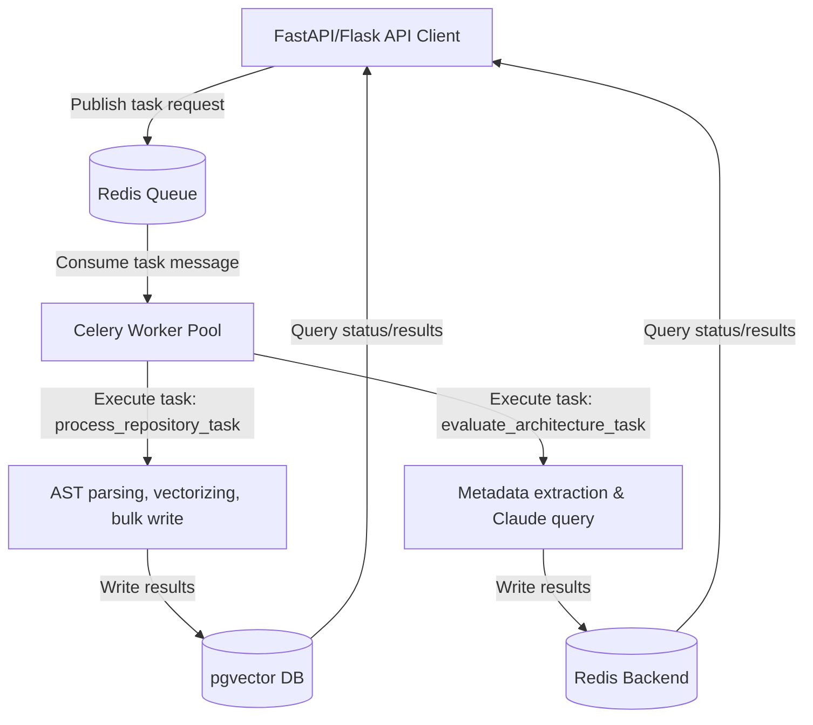

# Technical Blueprint: Celery & Redis Integration

This blueprint covers the asynchronous background execution architecture, event worker lifecycles, and broker link recovery protocols implemented on Day 13 of the sprint.

---

## 1. Background Execution Graph

To offload intensive tasks (AST parsing, vector calculation, database upserting, and API-based structural scoring) from the main API thread, the system delegates operations to background worker tasks:

---

## 2. Event Worker Lifecycle Management

Celery workers process tasks inside an event-driven lifecycle:

1.  **Initialization**: Celery boots up, reads the configuration in `celery_app.py`, connects to Redis, and registers tasks defined in `tasks.py`.
2.  **Received**: The worker picks up a task message from the Redis queue. The task state transitions to `PENDING` $\to$ `STARTED`.
3.  **Execution**: The task executes inside a child process. The system configures `worker_concurrency=4` to allow concurrent file parsing and API calls.
4.  **Completion/Termination**:
    *   **Success**: The return payload is serialized to JSON and stored in the Redis results backend under the task ID. The state transitions to `SUCCESS`.
    *   **Failure**: If an unhandled exception is caught, the task state transitions to `FAILURE`. Detailed traceback info is logged and saved in Redis.

---

## 3. Resilience Protocols for Connection Loss

To safeguard execution under broker/database connection drops, we implement several retry and connection recovery strategies:

### A. Broker Connection Recovery (Celery-level)
*   **Startup Recovery**: `broker_connection_retry_on_startup=True` commands the worker to retry connecting to Redis during boot rather than crashing instantly.
*   **Reconnection Retries**: `broker_connection_max_retries=5` sets a threshold for reconnect attempts if Redis drops offline during operation.

### B. Task-level Re-execution (Application-level)
*   **Transient Failures**: Network latency, database deadlocks, or Anthropic rate limits are transient.
*   **Bound Retries**: Tasks are bound (`bind=True`), exposing the `self.retry` interface.
*   **Backoff Delay**:
    *   `max_retries=3` limits retry attempts to prevent infinite loops.
    *   `default_retry_delay=15` introduces a 15-second rest period before trying again, giving external systems time to recover.

---

## 4. Implementation Location
*   Celery Application Core: [celery_app.py](file:///c:/Users/MANAV/Desktop/Adani%20Uni/Projects/Aiagents/agents/originality/celery_app.py)
*   Task Definitions: [tasks.py](file:///c:/Users/MANAV/Desktop/Adani%20Uni/Projects/Aiagents/agents/originality/tasks.py)
