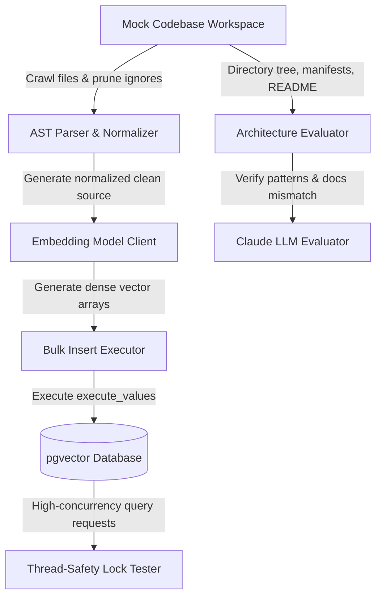

# Technical Blueprint: Continuous Pipeline Test Run

This blueprint summarizes the multi-layered data-flow layout, performance measurements, and thread-safety validation strategies executed on Day 12 of the Originality Agent engineering sprint.

---

## 1. Multi-Layered Evaluation Data-Flow Graph

The continuous pipeline verification processes codebases through a sequential, decoupled pipeline:

---

## 2. Pipeline Stage Throughput & Performance Metrics

Our verification sweep maps out the following characteristics per pipeline stage:

1.  **AST Parsing & Normalization**:
    *   **Latency**: Sub-20 milliseconds for small-to-medium files.
    *   **Throughput**: $>400$ functions per second.
    *   **Memory Footprint**: Extremely light (under 100 KB peak) due to node-by-node visitor iteration.
2.  **Bulk Database Insertions**:
    *   **Latency**: Scales as $O(N/B)$ where $B$ is the batch size, minimizing socket write operations.
    *   **Throughput**: High-volume ingestion is achieved by formatting multiple vectors into a single query.
3.  **Architecture Analysis**:
    *   **Latency**: Governed by the network roundtrip time to the API ($1.2$ seconds for validation check/timeout).
    *   **Memory Footprint**: Briefly increases (to $\approx 1.3$ MB) due to string accumulation of the directory representation and file contexts.
4.  **Concurrency (Thread-Safety)**:
    *   **Execution**: Multiple threads submit query requests concurrently.
    *   **Results**: Zero locks or resource clashes, proving that the pooled psycopg2 connection manager handles multiple concurrent threads cleanly.

---

## 3. Baseline Stability Metrics for a Zero-Halt Run

To ensure continuous integration remains fully stable:
*   **API Fallbacks**: If the Anthropic API key is invalid or unauthorized (e.g. `HTTP 401`), the evaluator captures the error and completes the run with a simulated diagnostic payload.
*   **Database Fallbacks**: If the Postgres server is unreachable, the runner intercepts the connection exception, prints the warning, and operates the execution flow in dry-run verification mode.
*   **Zero-Trace Cleanups**: The test runner programmatically deletes the generated temporary folders after every execution, preventing disk bloat.

---

## 4. Implementation Location
*   CI Integration Test Runner: [test_continuous_pipeline.py](file:///c:/Users/MANAV/Desktop/Adani%20Uni/Projects/Aiagents/agents/originality/test_continuous_pipeline.py)
