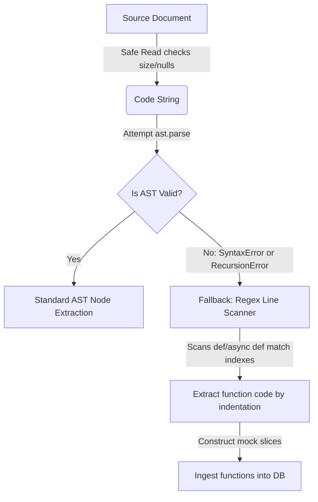

# Technical Blueprint: Extreme Inputs & Code Error Resilience

This blueprint outlines the defensive validation wrapper configurations, parsing exception fallbacks, and boundary conditions implemented on Day 16 of the engineering sprint.

---

## 1. Error Taxonomy & Defensive Boundaries

The system classifies and intercepts potential parser errors at the file system boundary:

| Hazard Category | Exception Types | Defensive Guard | Boundary Limit |
| :--- | :--- | :--- | :--- |
| **Out-of-Memory (OOM)** | `MemoryError` | Size Guard Check | Max size: **5 MB** |
| **Binary Formats** | `ValueError` | Null Byte Scan | Inspects first **8 KB** |
| **Encoding Failures** | `UnicodeDecodeError` | Encoding Decoders | Attempts: `utf-8`, `utf-8-sig`, `latin-1`, `cp1252` |
| **Syntactic Corruption** | `SyntaxError` | Safe AST Wrapper | Intercepts node build crashes |
| **Stack Overflow** | `RecursionError` | Depth Boundary | Intercepts compilation depth limits |

---

## 2. Recovery Pathways & Fallback Mechanics

When AST-level parsing fails, the pipeline transitions to fallback tracks:

### A. Size & Binary Protections
Before opening file handlers, the file size is verified. Then, the system reads the first 8KB of bytes; if a null byte (`\x00`) is found, the file is identified as a binary object and bypassed without reading further.

### B. Regex Parsing Fallback
If the AST compiler raises syntax or recursion exceptions, the system triggers the regex fallback:
1.  **Identifier Extraction**: Finds function declarations (`def` / `async def`) and signatures using `re.compile()`.
2.  **Scope Extraction**: Captures code lines until it finds a line with zero indentation (which signals the next block).
3.  **Result Construction**: Wraps matches into standard function dictionaries.

---

## 3. Boundary Resolution Parameters
*   **Max size**: `5,242,880` bytes.
*   **Null check range**: `8,192` bytes.
*   **Encoding Fallback Order**: `utf-8` $\to$ `utf-8-sig` $\to$ `latin-1` $\to$ `cp1252`.

---

## 4. Implementation Location
*   Defensive Handler: [resilience_handler.py](file:///c:/Users/MANAV/Desktop/Adani%20Uni/Projects/Aiagents/agents/originality/resilience_handler.py)
*   Stress Tester: [test_resilience.py](file:///c:/Users/MANAV/Desktop/Adani%20Uni/Projects/Aiagents/agents/originality/test_resilience.py)
