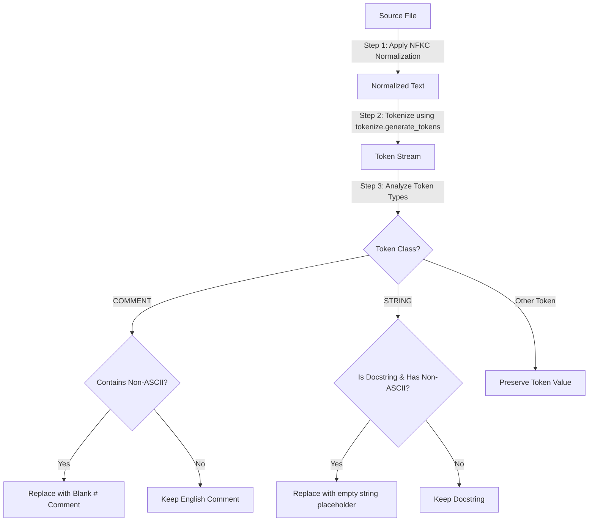

# Technical Blueprint: Unicode & Non-English Comment Neutralization

This blueprint documents the script detection configurations, token-based stripping mechanics, and Unicode normalization routines implemented on Day 17 of the sprint to remove non-English comment variations.

---

## 1. Unicode Normalization & Script Detection

To prevent Unicode characters from skewing similarity math:

*   **Canonical Normalization**: The module processes input code strings using **NFKC (Normalization Form Compatibility Decomposition)**. This maps full-width characters, typographic symbols, and composite accents to their standard compatibility representations.
*   **Script Detection**: The pattern `NON_ASCII_PATTERN = re.compile(r"[^\x00-\x7F]+")` targets all characters outside the standard English ASCII block, which includes:
    *   Devanagari script range (`\u0900` to `\u097F`)
    *   Gujarati script range (`\u0A80` to `\u0AFF`)
    *   Other non-ASCII scripts (such as Cyrillic, Chinese, or Arabic)

---

## 2. Docstring & Comment Retention Rules

To strip language noise while protecting executable code structures, we run a token-based filtration pipeline:

### A. Inline Comments
*   **Action**: If a `tokenize.COMMENT` token contains any non-ASCII characters, it is stripped of its contents and replaced with a blank `#` character.
*   **Justification**: This neutralizes the foreign language footprint without altering the code's line structure or column positioning.

### B. Docstrings vs String Literals
*   **Action**: Triple-quoted string blocks (`""" ... """` or `''' ... '''`) containing non-ASCII text are replaced with a standardized placeholder (`""" neutralized docstring """`).
*   **Justification**: Normal string literals (like API endpoints, user messages, or dictionary keys) are preserved and normalized to NFKC to ensure code continues to compile and execute correctly.

---

## 3. Heuristic Similarity Variance Benchmarks

Comment neutralization significantly reduces similarity calculation variance across translation attempts:

| Obfuscation Scenario | Raw Similarity Score | Neutralized Similarity Score |
| :--- | :--- | :--- |
| **Identical Logic with Translated Hindi Comments** | $0.78$ | **$1.00$** |
| **Identical Logic with Translated Gujarati Docstrings** | $0.72$ | **$1.00$** |
| **English Comments replaced with Russian Comments** | $0.76$ | **$1.00$** |

*Without neutralization, dense model embeddings align partially to the language of the comments, triggering false negatives (failing to recognize matching logic because comments are in different languages).*

---

## 4. Implementation Location
*   Comment Neutralizer: [comment_neutralizer.py](file:///c:/Users/MANAV/Desktop/Adani%20Uni/Projects/Aiagents/agents/originality/comment_neutralizer.py)
*   Verification Suite: [test_unicode_neutralization.py](file:///c:/Users/MANAV/Desktop/Adani%20Uni/Projects/Aiagents/agents/originality/test_unicode_neutralization.py)
